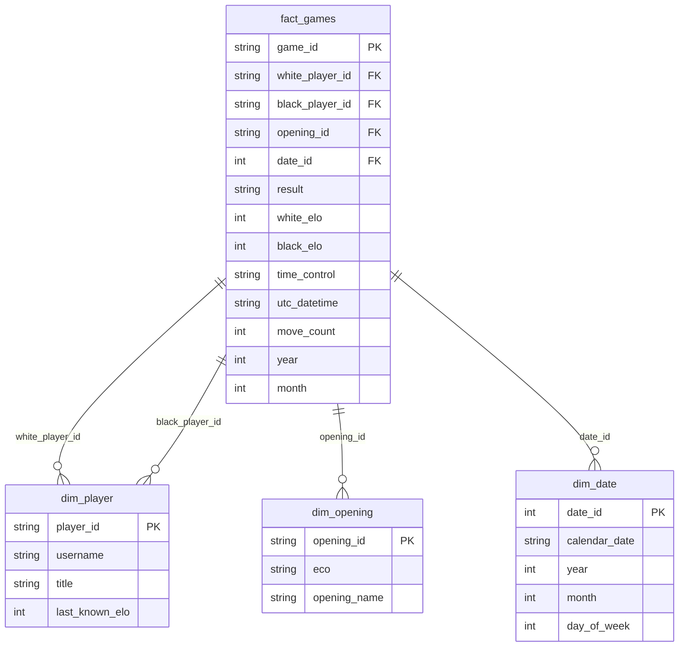

# Object storage (MinIO) and DuckDB analytics

This document describes how the Lichess pipeline lands raw shards in MinIO, transforms them into partitioned star-schema Parquet, loads them into DuckDB, and exports a wide table for the existing ML preprocessing path.

Related docs:

- [Artifact management](./artifact-management.md) — local export cache under `artifacts/`
- [Airflow ingestion](./airflow-ingestion.md) — monthly DAG with ELT tasks
- [Package organization](./package-organization.md) — phased Docker rollout

## Why MinIO, Parquet, and DuckDB

| Layer | Role |
|-------|------|
| **MinIO** | S3-compatible object store for immutable raw `.pgn.zst` and curated Parquet; portable to AWS S3 in production |
| **Parquet** | Columnar format with compression and predicate pushdown for Spark/DuckDB scans |
| **DuckDB** | Embedded columnar SQL engine over Parquet for validation, analytics, and wide-table export |

The pipeline follows **ELT**: load the compressed shard unchanged into MinIO, transform with a star-schema job, then query or export from DuckDB.

## Bucket layout

| Bucket | Prefix | Content |
|--------|--------|---------|
| `lichess-raw` | `pgn/lichess_db_standard_rated_YYYY-MM.pgn.zst` | Verified monthly shard |
| `lichess-processed` | `fact_games/year=YYYY/month=MM/` | Game fact rows (Hive partitions) |
| `lichess-processed` | `dim_player/`, `dim_opening/`, `dim_date/` | Dimension tables |
| `lichess-processed` | `wide_games/year=YYYY/month=MM/` | Denormalized games for ML bridge |

Local mirror (export cache): `artifacts/lichess_data/processed/YYYY-MM.parquet` — written by `duckdb-sync` for preprocess/Feast.

DuckDB catalog: `artifacts/lichess_data/duckdb/lichess.duckdb`

## Star schema



`fact_moves` is planned but not implemented in this phase.

## Environment variables

| Variable | Default | Purpose |
|----------|---------|---------|
| `AWS_ENDPOINT_URL` | `http://localhost:9000` | MinIO API (`http://minio:9000` inside Docker) |
| `AWS_ACCESS_KEY_ID` / `AWS_SECRET_ACCESS_KEY` | `minioadmin` | S3 credentials |
| `LICHESS_STORAGE_BACKEND` | `minio` | `minio` enables upload/transform/sync; `local` keeps Phase 1 extract path |
| `LICHESS_RAW_BUCKET` | `lichess-raw` | Raw bucket override |
| `LICHESS_PROCESSED_BUCKET` | `lichess-processed` | Processed bucket override |
| `SPARK_MASTER_URL` | `spark://spark:7077` | Spark cluster for `--spark-cluster` |
| `ARTIFACT_DIR` | `{repo}/artifacts` | Local artifact root |

Configure defaults in [`packages/lichess_data/configs/default.yaml`](../packages/lichess_data/configs/default.yaml) under `storage:`.

## ELT commands (host)

Start MinIO (and optionally Spark):

```bash
docker compose --profile core up -d
docker compose --profile core --profile pipeline up -d   # optional Spark cluster
```

Run the monthly ELT chain for one shard:

```bash
export AWS_ENDPOINT_URL=http://localhost:9000
export LICHESS_STORAGE_BACKEND=minio

uv run lichess-data download --month 2013-01
uv run lichess-data upload --month 2013-01
uv run lichess-data spark-transform --month 2013-01
uv run lichess-data duckdb-sync --month 2013-01
uv run lichess-data preprocess --month 2013-01
```

Use `--local` on `spark-transform` to write star-schema files under `artifacts/lichess_data/processed/star_schema/` without MinIO (useful for tests and offline dev).

Legacy extract path (no MinIO):

```bash
export LICHESS_STORAGE_BACKEND=local
uv run lichess-data download --month 2013-01
uv run lichess-data extract --month 2013-01
uv run lichess-data preprocess --month 2013-01
```

## DuckDB inspection

Open the catalog with the tools profile:

```bash
docker compose --profile tools run --rm duckdb \
  artifacts/lichess_data/duckdb/lichess.duckdb
```

Example queries:

```sql
SELECT year, month, COUNT(*) AS games FROM fact_games GROUP BY 1, 2;
SELECT COUNT(*) AS null_elo FROM fact_games WHERE white_elo IS NULL OR black_elo IS NULL;
SELECT eco, COUNT(*) AS n FROM dim_opening o
JOIN fact_games f ON f.opening_id = o.opening_id GROUP BY 1 ORDER BY 2 DESC LIMIT 10;
```

## Bridge to ML pipeline

`duckdb-sync` exports `artifacts/lichess_data/processed/YYYY-MM.parquet` from `wide_games` (or a SQL join over the star schema). Downstream steps are unchanged:

1. `lichess-data preprocess` — feature engineering
2. `lichess-features split` — Feast split
3. `lichess-models train` — model training

Great Expectations validates the exported wide parquet with the same `processed` suite as the legacy extract output.

## Airflow

The `lichess_monthly_ingestion` DAG runs the ELT chain when `use_elt=true` (default) or `LICHESS_STORAGE_BACKEND=minio`:

```
download → upload → spark-transform → duckdb-sync → preprocess → feast split → validate → validate-ge → train
```

Set DAG param `use_elt: false` to use `extract` instead of the ELT steps. See [Airflow ingestion](./airflow-ingestion.md).

## Troubleshooting

| Symptom | Check |
|---------|--------|
| Upload fails with connection error | MinIO running? `AWS_ENDPOINT_URL` correct for host vs Docker? |
| `spark-transform` file not found | Run `download` first; raw path is `artifacts/lichess_data/raw/pgn/` |
| DuckDB S3 read fails | `httpfs` settings; bucket keys exist under `lichess-processed/` |
| GE processed validation fails after ELT | Re-run `duckdb-sync`; export must include `white`, `black`, `utc_date`, `utc_time`, `result` |
| Spark OOM on large months | Increase worker memory in [`services/spark/docker-compose.yml`](../services/spark/docker-compose.yml); test with `2013-01` first |
