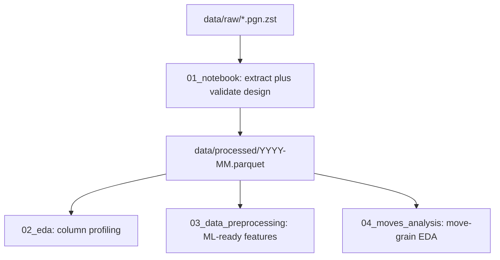
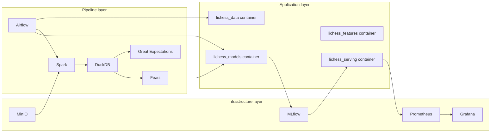
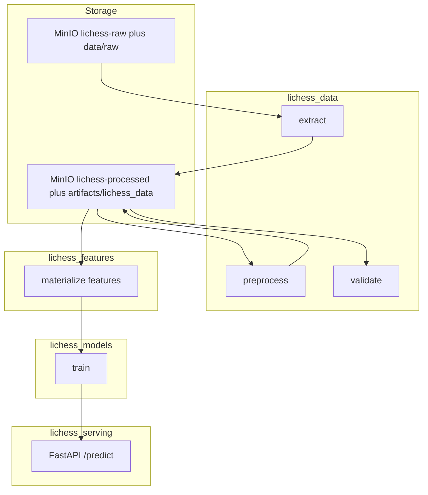

# Package organization and Docker services

This guide maps experimental work in `[notebook/](../notebook/)` onto the uv workspace packages under `[packages/](../packages/)`, spells out conventions for configuration and artifacts, and describes how Docker-based services fit together once you productionize the MLOps stack (as designed in `[report/content/02-pipeline-design.tex](../report/content/02-pipeline-design.tex)`).

Related docs:

- [Config loading](./config-loading.md) — `load_config`, YAML merge
- [Artifact management](./artifact-management.md) — `get_run_dir`, `ARTIFACT_DIR`
- [Object storage and DuckDB](./object-storage-and-duckdb.md) — MinIO ELT pipeline
- [Logging and exceptions](./logging-and-exceptions.md)

## Current implementation status


| Layer                                                | Status                                                                                                              |
| ---------------------------------------------------- | ------------------------------------------------------------------------------------------------------------------- |
| **Notebooks** (`notebook/01`–`04`)                   | Working prototypes: PGN→Parquet extract, EDA, preprocessing features, move-level analysis                           |
| **Packages** (`packages/lichess_*`)                  | `lichess_data` and `lichess_features` pipelines are wired; ELT upload/transform/DuckDB sync in `lichess_data`; `lichess_models` trains player-centric outcome models; `lichess_serving` exposes FastAPI `/predict` |
| **Shared libs** (`libs/shared/`)                     | Ready: `load_config`, artifact helpers, logging                                                                     |
| **Docker Compose** (`[services/](../services/)`) | Root [`docker-compose.yml`](../docker-compose.yml) includes profiled stacks per component; shared network `lichess-net` + open-source MinIO; see [`services/README.md`](../services/README.md) |
| **Report** (`report/content/02-pipeline-design.tex`) | Target architecture (Airflow, MinIO, Spark, DuckDB, Great Expectations, Feast, MLflow, FastAPI, Prometheus/Grafana) |


Treat notebooks as the **behavioral spec** for what to implement first; treat the LaTeX report as the **infrastructure spec** for how services orchestrate runs at scale.

## Pipeline overview (from notebooks)

The repository stores experiments under `**notebook/`** (singular), not `notebooks/`.




**Facts worth carrying into packages:**

1. `**[01_notebook.ipynb](../notebook/01_notebook.ipynb)`** downloads or reads a monthly Lichess standard-rated shard (`.pgn.zst`), parses headers and moves, and batches rows to Parquet (`pyarrow`). It currently **writes** the main derived table used by later notebooks—for example ~121k games in `2013-01.parquet` with 18 columns.
2. `**[03_data_preprocessing.ipynb](../notebook/03_data_preprocessing.ipynb)`** has the richest **pandas** transformations (event parsing, time-control categories, outcome labels, temporal and time-of-day features, Elo imputation by time control). In the exploratory state it typically does **not** persist a second Parquet artifact; production code should fix that explicitly.
3. `**[02_eda.ipynb](../notebook/02_eda.ipynb)`** and `**[04_moves_analysis.ipynb](../notebook/04_moves_analysis.ipynb)**` are **read-mostly** profiling steps. They justify validation rules (`02`) and motivate optional move-level modeling or `fact_moves` work (`04`).

**Primary ML task** described in coursework material: **pre-game outcome prediction**—three-way classification (`1-0`, `0-1`, `1/2-1/2`) from ratings, time control, opening metadata, temporal context, etc.

## Package-to-stage mapping


| Pipeline stage         | Source notebook(s)                          | Package                  | Target submodules                                                                     |
| ---------------------- | ------------------------------------------- | ------------------------ | ------------------------------------------------------------------------------------- |
| Extract + load         | `01_notebook`                               | `lichess_data`           | `extract/` (PGN→Parquet), optional `load/` for object storage uploads                 |
| Validate               | stubs in `01` + findings in `02`            | `lichess_data`           | `validate/` (Great Expectations minimal checks implemented)                           |
| Preprocess / transform | `03`, partially schema from `01`            | `lichess_data`           | `preprocessing/` (pandas locally; Spark job when you adopt the report stack)          |
| EDA / move analysis    | `02`, `04`                                  | *(no dedicated package)* | Keep in `notebook/` or migrate one-off scripts to `scripts/` until rules are codified |
| Feature engineering    | plan in `01` + engineered columns from `03` | `lichess_features`       | feature definitions plus Feast repo when offline store exists                         |
| Train + evaluate       | `TimeSeriesSplit` demo in `01`              | `lichess_models`         | split, train, evaluate, MLflow registration                                           |
| Serve + observe        | report (deployment chapter)                 | `lichess_serving`        | FastAPI app, Prometheus-compatible metrics hooks                                      |


**Artifact rule:** one workspace package corresponds to one top-level artifact namespace `[artifacts/<component>/](./artifact-management.md)`, where `<component>` matches the folder name under `packages/` (for example `lichess_data`, `lichess_models`). Use `[get_run_dir](../libs/shared/artifact_manager.py)` for timestamped runs.

## Recommended directory layout inside packages

The trees below describe where code should land as you port notebooks into importable modules. They are conventions, not a requirement that every file exist on day one.

### `lichess_data`

Owns raw→curated datasets and validates them before features or training.

```
packages/lichess_data/
├── configs/default.yaml      # paths, batch size, thresholds
└── src/lichess_data/
    ├── cli.py                 # subcommands: extract, preprocess, validate (optional grouping)
    ├── extract/
    │   ├── parser.py          # parse_game(), safe_int() from notebook 01
    │   ├── lichess_downloader.py  # monthly HTTPS .pgn.zst download + SHA256
    │   └── writer.py          # streamed Parquet batching
    ├── preprocessing/
    │   ├── transforms.py      # port logic from notebook 03
    │   └── pipeline.py        # orchestrates transforms in order
    └── validate/
        ├── checks.py          # elo, result, broken games
        └── runner.py          # full_validation() entrypoint
```

See [Lichess database downloader](./lichess-database-downloader.md) for the monthly HTTPS ingestion module (`extract/lichess_downloader.py`): checksums, resume, CLI, and artifact paths.

### `lichess_features`

Holds deterministic feature transforms that must stay aligned with offline training and online inference (eventually Feast point-in-time materialization backed by DuckDB or Parquet).

```
packages/lichess_features/
├── configs/default.yaml       # views, entities, TTLs, joins
└── src/lichess_features/
    ├── feature_defs.py
    └── materialize.py         # Feast apply / export hooks
```

### `lichess_models`

Training binaries, chronological splits, and experiment tracking.

```
packages/lichess_models/
├── configs/default.yaml       # model family, hyperparameters, split policy
└── src/lichess_models/
    ├── split.py               # chronological TimeSeriesSplit or equivalent
    ├── train.py
    ├── evaluate.py
    └── register.py            # MLflow model registry helpers
```

### `lichess_serving`

Inference API and deployment surface.

```
packages/lichess_serving/
├── configs/default.yaml       # server host, MODEL_URI fallback, timeouts
├── Dockerfile                 # Future: bake FastAPI plus dependencies
└── src/lichess_serving/
    ├── app.py                  # FastAPI routes
    └── schemas.py              # payloads matching preprocessing or feature schemas
```

### Cross-cutting conventions

1. **Configuration** — Prefer `[load_config(<component>)](./config-loading.md)` where `<component>` is the package directory name. Move any stray keys from `[packages/lichess_data/src/lichess_data/extract/config.yaml](../packages/lichess_data/src/lichess_data/extract/config.yaml)` into `packages/<component>/configs/default.yaml` and retire ad-hoc paths once wiring is proven.
2. **Outputs** — Write pipeline outputs via `[get_artifact_path` / `get_run_dir](./artifact-management.md)` instead of notebook-style absolute filesystem paths.
3. **Local data** — Under `data/raw/` (or MinIO buckets in Docker phases). Gitignored blobs stay out of version control; keep small samples documented in README where appropriate.

## Example `lichess_data` configuration

Starter shape for `[packages/lichess_data/configs/default.yaml](../packages/lichess_data/configs/default.yaml)`—adjust paths to match your shard:

```yaml
extract:
  input: data/raw/lichess_db_standard_rated_2013-01.pgn.zst
  output_subpath: processed/2013-01.parquet
  batch_size: 5000

preprocessing:
  impute_elo_by: time_control
  drop_columns:
    - date
    - round

validation:
  expected_results:
    - "1-0"
    - "0-1"
    - "1/2-1/2"
  max_null_elo_ratio: 0.01
```

Application code can resolve deterministic paths with:

```python
from pathlib import Path

from libs.shared import get_artifact_path, load_config

cfg = load_config("lichess_data")
out_rel = cfg["extract"]["output_subpath"]
processed_path = get_artifact_path("lichess_data", out_rel, create=True)
```

Alternatively, use timestamped directories per run via `get_run_dir("lichess_data")` when you emit training snapshots.

## Notebook to package migration checklist

Work through these in order. Validate each step **on the host** with `uv run` before you depend on Airflow or Compose.

1. **Extract** — Lift `parse_game` and batched Parquet writing from notebook `01` into `lichess_data.extract`; expose `lichess-data extract` (or equivalent) wired to YAML.
2. **Validate** — Replace placeholder validators with rules inferred from notebook `02` (null Elo proportions, stray `Result` tokens, degenerate rows, missing move sequences).
3. **Preprocess** — Port dataframe transforms from notebook `03` into `lichess_data.preprocessing`, writing an explicit preprocessing artifact alongside raw Parquet.
4. **Features** — Freeze a schema of training columns; migrate stable transforms into `lichess_features`; add Feast when DuckDB-backed offline reads exist.
5. **Train** — Move sklearn / split logic from exploratory cells into `lichess_models` and log metrics and models to MLflow.
6. **Serve** — Load the registered artifact in FastAPI; keep request payloads byte-for-byte compatible with preprocessing outputs or feature-service responses.

Only after commands succeed locally should you invoke the same CLI from Airflow Operators or ephemeral task containers.

## Docker services — target runtime

Subdirectories under [`services/`](../services/) carry Compose fragments that the root [`docker-compose.yml`](../docker-compose.yml) **includes**. All long-running workloads attach to a shared bridge **`lichess-net`**; stacks are gated with **profiles** so you enable only what you need (`core`, `ml`, `monitoring`, `orchestration`, `pipeline`, `feast`, `evidently`, `ge`, `tools`; plus Airflow **`flower`** and **`debug`**). Copy [`services/.env.example`](../services/.env.example) into a root or per-service `.env` for secrets — never commit real credentials. Operational detail lives in **[`services/README.md`](../services/README.md)**.

Below is how those pieces relate once implemented, matching the coursework pipeline narrative.

### Service dependency sketch




| Path under `services/`     | Intended responsibility                                                                 |
| -------------------------- | --------------------------------------------------------------------------------------- |
| `minio/`                   | S3-compatible buckets for raw immutable `.pgn.zst` and processed Parquet prefixes       |
| `airflow/`                 | Scheduler and web UI; mounts DAG definitions (for example under `app/dags/` when added) |
| `spark/`                   | Distributed transform job reading MinIO streams, writing partitioned Parquet            |
| `duckdb/`                  | Optional long-lived analytic database over processed Parquet                            |
| `great_expec/`             | Great Expectations metadata store (optional), GE runs via `lichess_data` CLI           |
| `feast/`                   | Feature store coordinator plus offline configuration                                    |
| `mlflow/`                  | Tracking server backed by filesystem or MinIO artifact store                            |
| `evidently/`               | Drift dashboards or batch evaluations (parallel to Prometheus for model quality)        |
| `prometheus/`              | Prometheus + Grafana (Grafana provisioning under `services/prometheus/grafana/`)         |


The **`docker-compose.yml` at repo root** already `include`s fragments under `services/` and declares shared network **`lichess-net`** plus named volumes (for example MinIO data, Postgres for Airflow / MLflow metadata, Prometheus and Grafana storage).

### How runs flow after composition

End-to-end data movement from packages through storage and serving:




**Typical invocation pattern (documentation target only):**

```bash
# Infrastructure slice while you iterate on extraction locally
docker compose --profile core --profile ml up -d

# Full stack once DAGs exist (add profiles as needed — see services/README.md)
docker compose \
  --profile core --profile ml --profile monitoring \
  --profile orchestration --profile pipeline \
  up -d

# Run the data package against remote MinIO endpoints from host
ARTIFACT_DIR=./artifacts \
  MLFLOW_TRACKING_URI=http://localhost:5000 \
  uv run lichess-data extract
```

Adapt **profiles** (`core`, `ml`, …) to the subsets you need — `docker compose config` without profiles shows an empty service map because every stack is profile-gated.

### Environment variables to standardize early


| Variable                     | Consumers                                              | Purpose                                                                                             |
| ---------------------------- | ------------------------------------------------------ | --------------------------------------------------------------------------------------------------- |
| `ARTIFACT_DIR`               | All pipeline CLIs when not using purely remote storage | Local artifact mirror under `[artifact management](./artifact-management.md)`                       |
| `MINIO_ENDPOINT` *(example)* | `lichess_data` extract/upload, Spark, MLflow backends  | Resolve S3-compatible endpoint inside Docker network (`http://minio:9000` style) versus `localhost` |
| `MLFLOW_TRACKING_URI`        | `lichess_models`                                       | HTTP(S) MLflow tracking server                                                                      |
| `FEAST_REPO_PATH`            | `lichess_features`                                     | Path to Feast repository YAML inside container                                                      |
| `MODEL_URI` *(example)*      | `lichess_serving`                                      | Loads the promoted model artifact or registry URI                                                   |


Expose these through Compose `environment:` blocks so host and container agree on namespaces.

### Airflow DAG pseudocode

High-level orchestration once everything is wired:

```
download_shard
  --> verify_checksum
  --> spark_transform
  --> validate_ge
  --> materialize_features
  --> train_model
  --> register_model
```

Each task should delegate to:

- `**uv run <cli>` on a worker image** baked with workspace dependencies, or
- `**docker compose --profile <name> run --rm <service>`** one-off containers per stage (for example `tools` for DuckDB).

Keep task boundaries aligned with package boundaries (`lichess_data`, `lichess_features`, `lichess_models`) so retries skip only failed layers.

### Phased adoption


| Phase       | What runs where                                              | Packages                                  |
| ----------- | ------------------------------------------------------------ | ----------------------------------------- |
| **Phase 0** | Notebooks touching local filesystem                          | *(none enforced)*                         |
| **Phase 1** | Host-only CLIs: `lichess-data {extract,preprocess,validate}` | `lichess_data`                            |
| **Phase 2** | MinIO + MLflow containers; ELT CLIs (`upload`, `spark-transform`, `duckdb-sync`) | `lichess_data`, `lichess_models`          |
| **Phase 3** | Airflow schedules container images or Operators              | All four workspace packages               |
| **Phase 4** | Serving image plus Prometheus scraping + Grafana dashboards  | `lichess_serving` plus observability dirs |


Advancing phases does not invalidate earlier ones—maintain reproducible notebooks or smoke tests anchored to pinned shards when possible.

## See also

- `[docs/notes/final_report.md](./notes/final_report.md)` — informal milestones and pitfalls during exploration
- `[todos.md](../todos.md)` — project-wide backlog hints (for example MLflow/Airflow/DVC checklist items)

