# Pipeline Evaluation and Monitoring

This document provides a detailed overview of the evaluation and monitoring framework for the Lichess chess outcome prediction model, translating the report findings and technical implementation details into our system documentation.

---

## Model Performance Evaluation

Evaluating a multiclass classification model (predicting white win, black win, or draw) requires looking beyond simple accuracy due to class imbalances and the inherent difficulty of predicting draws. Our evaluation pipeline uses MLflow and Evidently AI to compute, track, and visualize these performance metrics.

### Classification Metrics

Evidently AI calculates a comprehensive suite of classification metrics on our validation and test splits, including accuracy, precision, recall, and F1-score for each class (White Win, Black Win, Draw).

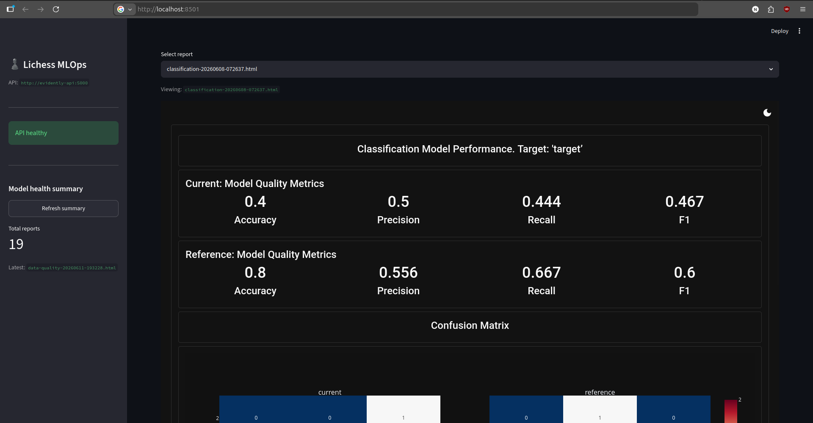

*Key Observations:*
- **Accuracy vs. F1-score:** Accuracy alone can be overly optimistic due to class distribution (draws are less common than wins). Monitoring macro-averaged F1-scores provides a more robust measure of performance across all outcomes.
- **Class Breakdown:** Performance is typically higher on decisive outcomes (wins/losses) compared to draws, reflecting the complexity of predicting peaceful results from pre-game features.

### Confusion Matrix Interpretation

The confusion matrix helps identify systematic misclassifications by mapping true outcomes against predicted outcomes.

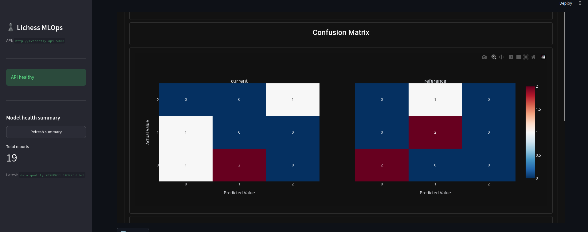

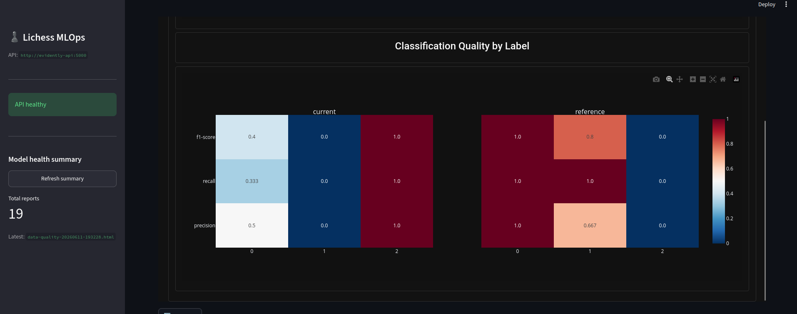

*Key Insights:*
- **Decisive Decisions:** The model successfully separates white wins from black wins with high reliability.
- **Draw Confusion:** The model often misclassifies draws as wins for either side, as draw boundaries are highly non-linear and heavily influenced by micro-tactical developments that pre-game ratings and time controls cannot fully capture.

### Performance on Test Set (January 2013 Data)

Autoritative evaluation metrics are scored on a hold-out test set consisting of January 2013 Lichess standard games.

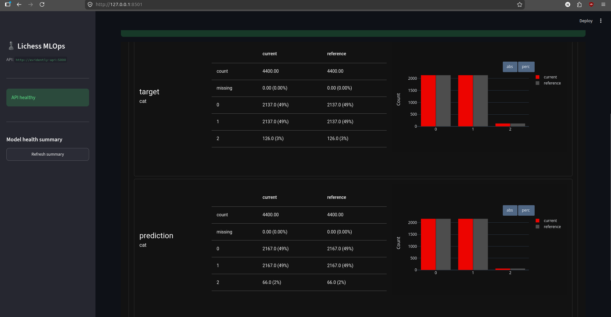

*Evaluation Summary:*
- Scoring the model on unseen data ensures generalization and guards against overfitting during hyperparameter tuning.
- The test metrics (saved automatically to the MLflow run directory and registry) serve as our baseline performance targets.

---

## Model Drift Analysis

Machine learning models deployed in production are susceptible to degradation over time due to shifts in data distributions.

### How drift could impact a chess outcome predictor

1. **Data Drift (Covariate Shift):**
   - **Rating Distribution Shift:** If rating inflation or deflation occurs in the player pool over time, the mean and variance of player ratings and rating differences will drift. A model trained on a specific rating distribution might see its numerical features drift outside of their typical range, leading to unreliable outputs.
   - **Opening Popularity Shift:** Chess opening trends change dynamically (often influenced by popular streamer content, high-profile tournaments, or engine breakthroughs). If a previously rare opening family (e.g., the Scandinavian or a specific gambit) suddenly spikes in popularity, the model will receive input features that were underrepresented during training.
   - **Time Control Distribution Shift:** A sudden change in player behavior, such as a shift from blitz to rapid or bullet controls, will alter the feature distribution of game types, shifting the input space away from the training baseline.

2. **Concept Drift:**
   - **Relationship Changes:** Concept drift occurs when the mapping between features and the target label shifts. For instance, if players within a specific Elo rating band become significantly better at defending drawish positions over time, the probability of a draw for a given rating difference will change.
   - **Theory Evolution:** If a new engine variant proves that a specific opening line is theoretically losing for Black, Black's win rate in that opening will drop across the board, rendering the historical mapping obsolete.

3. **Downstream Impact:**
   - Both forms of drift lead to model decay, manifesting as accuracy drops, poorly calibrated probability estimates, and incorrect recommendations for players or coaching services.

### Drift detection results from your pipeline

Our monitoring DAG uses the Evidently API to detect feature and target drift.

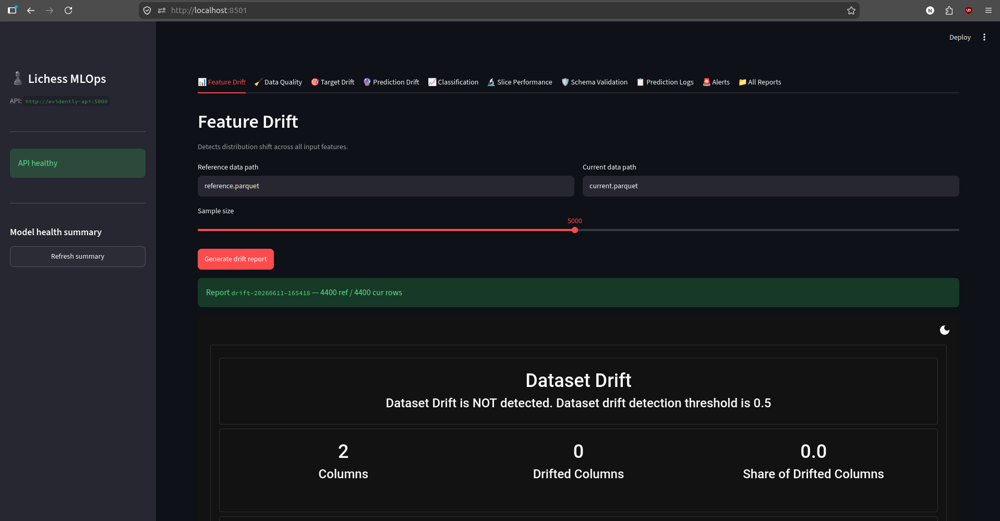

*Drift Metrics:*
- Evidently compares the reference dataset (e.g., January 2013 training data) with the current incoming batch (e.g., February 2013 predictions).
- Features such as player Elo, opponent Elo, and opening family are tested for distribution changes using statistical tests (Kolmogorov-Smirnov for numerical fields, Chi-Squared or PSI for categorical fields).
- If the drift score exceeds the set threshold (default `0.5`), an alert is triggered.

---

## Monitoring Strategy

Our production observability strategy covers three main pillars: serving performance, data quality, and concept/data drift.

### What is being monitored (predictions, features, performance)

1. **Predictions:**
   - The ratio of predicted classes (White Win, Black Win, Draw) is monitored continuously.
   - Sudden shifts in the distribution of predicted probabilities are tracked.

2. **Features:**
   - Distributions of numerical features (player/opponent Elo, Elo difference) and categorical features (ECO opening codes, game types).
   - Missing data rates (null values) are tracked to ensure upstream ingestion/scraping processes remain healthy.

3. **Performance & Infrastructure:**
   - Live classification metrics (accuracy, precision, recall) are calculated on a daily lag by matching prediction logs in MariaDB ColumnStore against true game outcomes.
   - API operational health is tracked via request throughput (QPS), HTTP latency, memory usage, CPU load, and network I/O.

### Monitoring tools and implementation (logging, alerts)

We utilize a modern, containerized monitoring stack:
- **Prometheus:** Scrapes serving-level metrics from the `/metrics` endpoint of the FastAPI app (using `prometheus_fastapi_instrumentator`) and system-level host metrics (from `node-exporter`).
- **Grafana:** Visualizes metrics on pre-configured, auto-provisioned dashboards.
- **Evidently API:** Generates programmatic reports and evaluates alert thresholds.

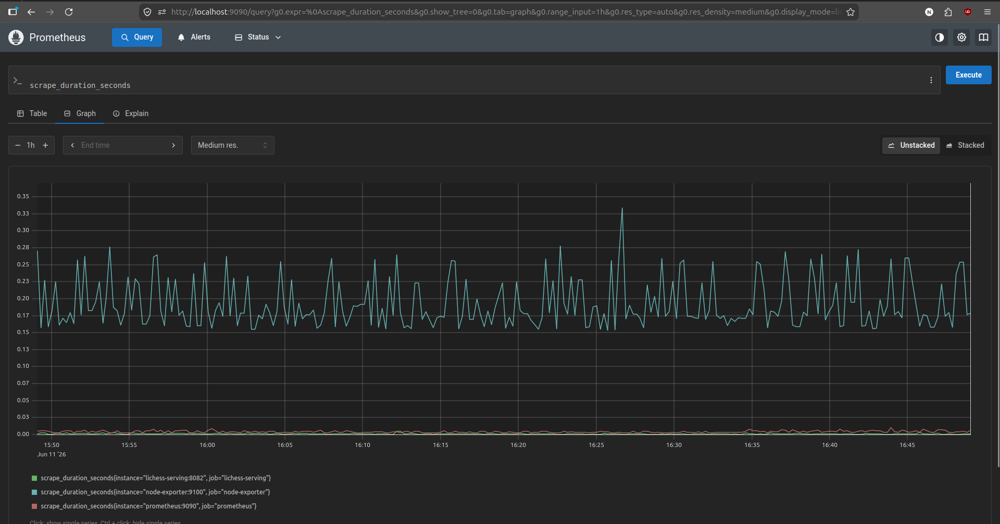

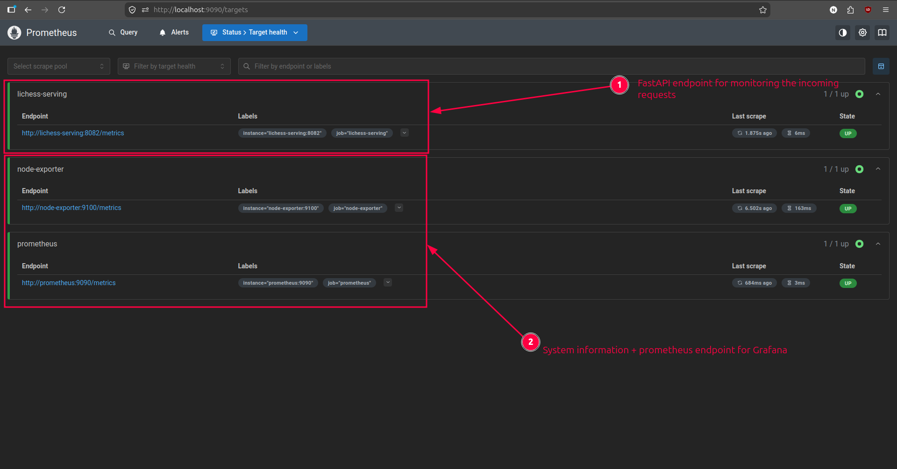

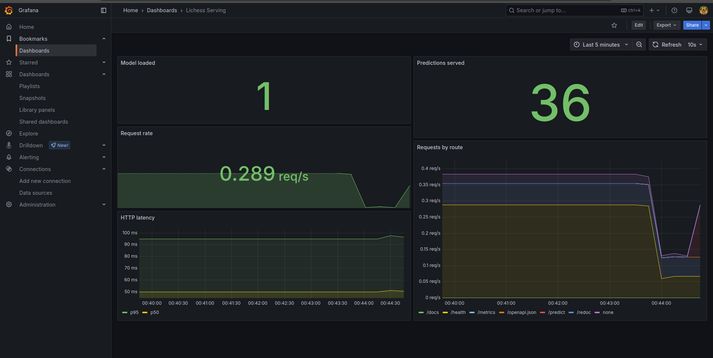

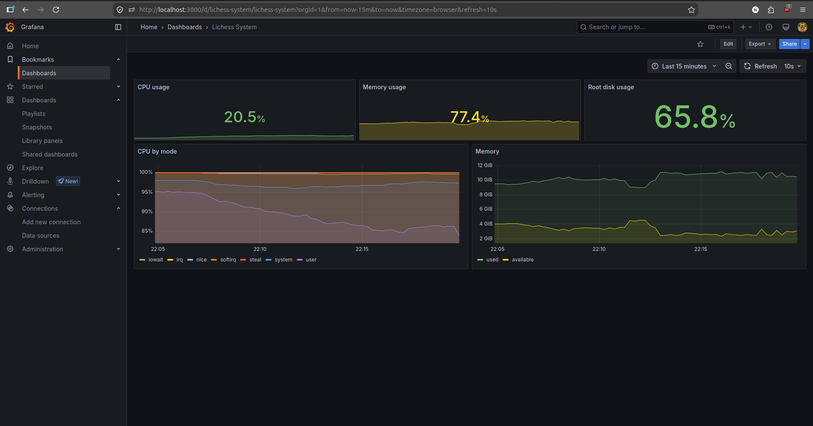

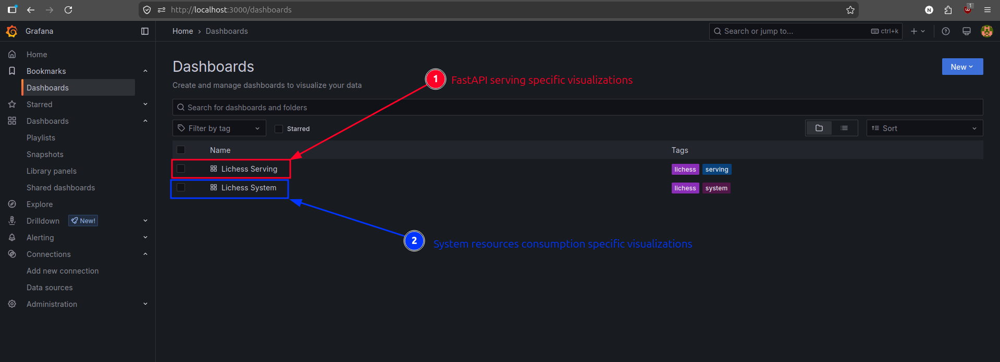

*Alerting Thresholds:*
Our FastAPI Evidently service evaluates alerts programmatically:
- **Drift Alert:** Triggered if the overall dataset drift score exceeds `0.5`.
- **Performance Alert:** Triggered if model accuracy drops below `0.65`.
- **Data Quality Alert:** Triggered if the ratio of missing values in incoming data exceeds `5%` (`0.05`).

Failures inside the Airflow pipelines and metrics anomalies trigger automatic notifications sent directly to our Slack channels (configured via webhook integrations).

### Retraining policy (periodic or drift-triggered)

We manage pipeline orchestration, drift analysis, and model retraining using **Apache Airflow**.

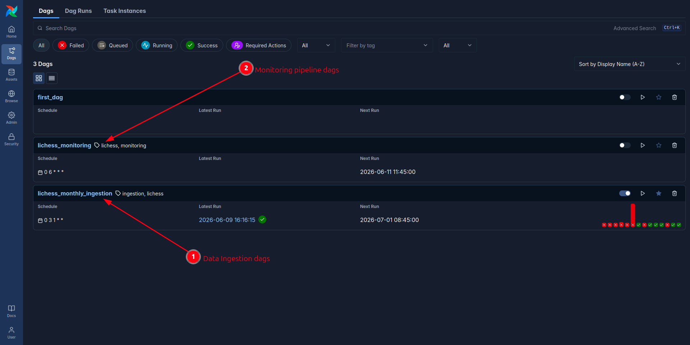

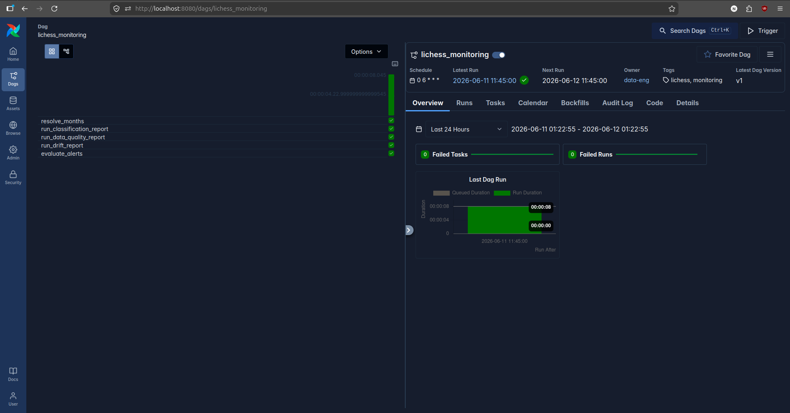

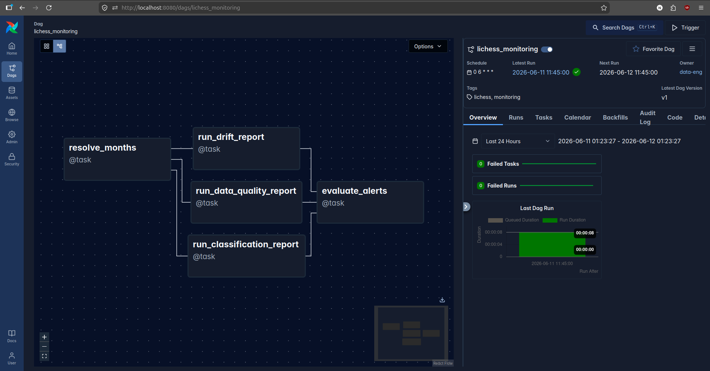

*Policy Implementation:*
- **Periodic/Scheduled Run:** A monthly data-ingestion DAG (`lichess_data`) automatically ingests new game files, validates the schema with Great Expectations, registers features in Feast, trains a new model candidate, and promotes it if validation holds.
- **Drift-Triggered Retraining:** The daily `lichess_monitoring` DAG runs Evidently reports on predictions retrieved from MariaDB ColumnStore. If an alert evaluates to a warning (e.g., accuracy < 0.65 or drift > 0.5), it triggers a retraining task run to refresh the model with the latest feature states.
